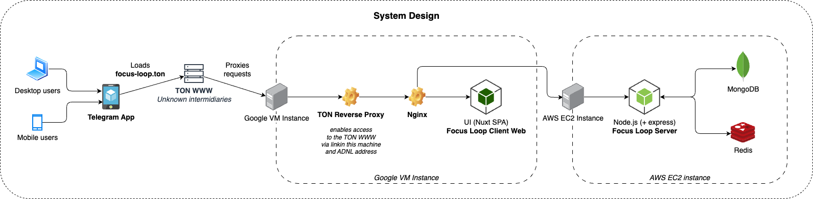

# Focus Loop

## Project Overview

**The Focus Loop** is designed to help users manage their tasks, manage tasks and deadlines effectively enabling Web3 integration via **TON Connect** leveraging **TON WWW** enabling access to the app in one click in **Telegram** via `focus-loop.ton`

## Technologies

### Client Web service

    - Nuxt 3 (Vue 3)
    - TypeScript
    - Vite
    - Pinia
    - Nuxt UI components (Tailwind CSS)
    - Sentry

### Server service

    - Node.js
    - Express
    - TypeScript
    - Unit tests: vitest

### Database services

    - MongoDB
    - Redis

### Misc

    - TON Reverse Proxy
    - Docker & Docker Compose
    - CI/CD: GitHub Actions
    - Google Cloud VM
    - AWS EC2
